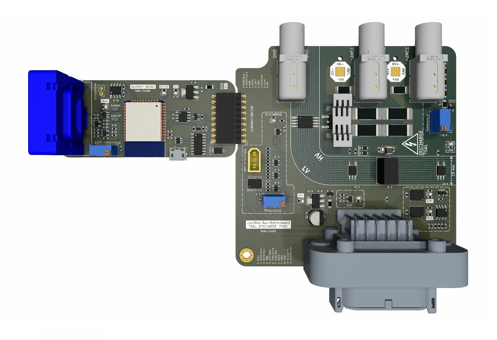
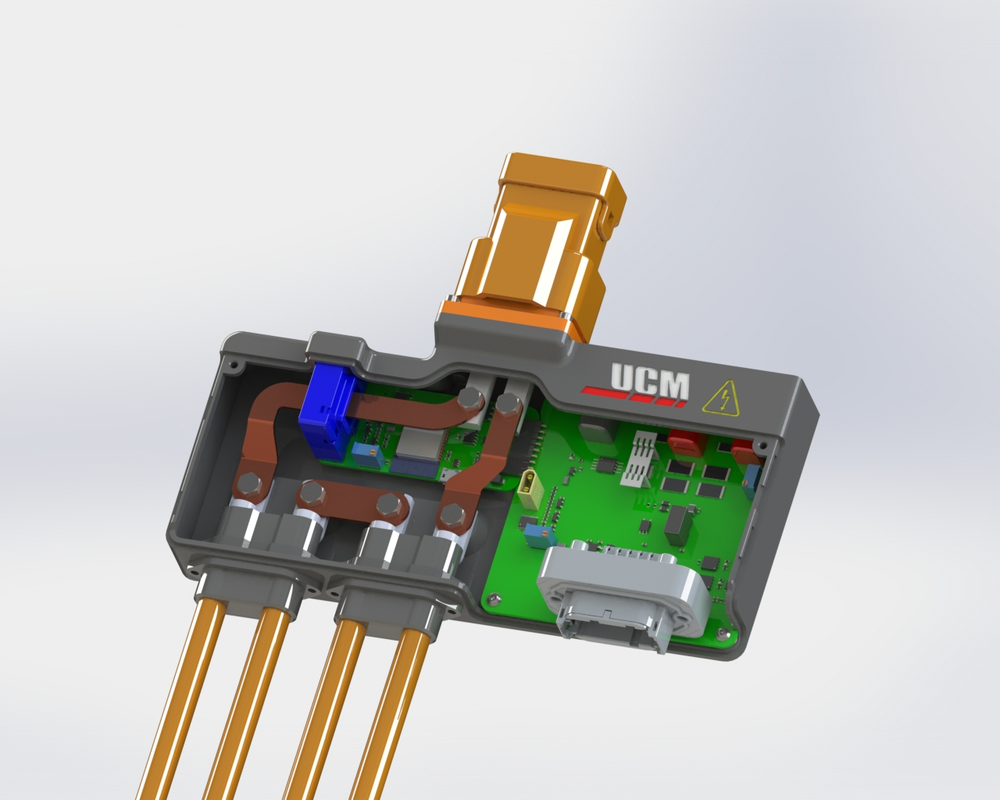

# VehicleJunctionBox
The junction box is an intermediate stage between the accumulator and inverter. It contains an HVD, a current sensor, discharge circuitry, TSAL and TSMPs. 

## PCBs & Enclosure

## Block Diagram

## Current Sense MCU IO
| Description  | IO |
| ------------- | ------------- |
| Local Fault | IO34 |
| Upstream Fault | IO35 |
| STATUS LED | IO12 |
| CAN RX | IO32 |
| CAN TX | IO26 |
| SDA | IO4 |
| SCL | IO15 |
| VREF | IO19 |
| LEM_OUT | IO21 |

## DTM PinOut
| Pin  | Description |
| ------------- | ------------- |
| 1 | GLV+ |
| 2 | BSPD Test Current + |
| 3 | BSPD Test Current - |
| 4 | GND |
| 5 | DOC Fault |
| 6 | TSAL Green |
| 7 | TSAL Red |
| 8 | BSPD 5kW Detect |
| 9 | CAN+ |
| 10 | CAN- |
| 11 | SD Loop In |
| 12 | SD Loop Out |

